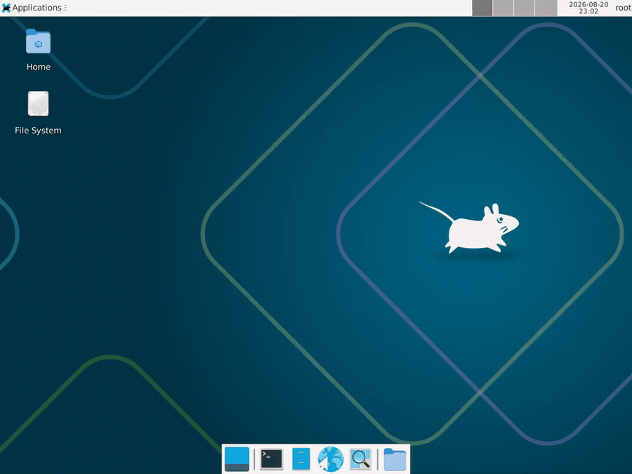

# AlbumFS

A read/write filesystem that lives inside a folder of photos.

[](https://github.com/itsbryanman/albumfs/actions/workflows/ci.yml)
[](LICENSE)
[](https://www.rust-lang.org/)
[](#install)
[](#status)
[](https://github.com/itsbryanman/albumfs/stargazers)



Point AlbumFS at a directory of pictures and it hands you back a filesystem. Write a file into it and the bytes get spread across the low bits of your photos, below the threshold your eye can see. Unmount, and the folder is just pictures again. Double-click any one of them and it opens as the same beach you shot last summer.

No cloud. No hidden partition. No container file sitting there looking suspicious. The data is in the pixels.

This is not steghide with extra steps. steghide drops one blob into one image. AlbumFS builds a real filesystem across the whole album, with directories, inodes, and free-space tracking, and lets you mount it and use it like any other disk.

## Status

Alpha. Being built in the open, one milestone at a time. Here is exactly what runs today so you are not chasing vaporware.

| Piece | State |
|---|---|
| PNG carrier codec (embed, extract, capacity) | shipped |
| Filesystem layer (superblock, inodes, bitmap) | shipped |
| FUSE mount with persistence | shipped |
| JPEG carriers (DCT coefficient domain) | shipped |
| Encryption (XChaCha20-Poly1305 + Argon2id) | shipped |
| Markerless encrypted mode with keyed embedding order | shipped |
| Format guard, stats, parser hardening, and CI | shipped |

The current tree includes the complete filesystem, carrier codecs, encryption, mount command, safety guard, statistics, and test suite.

## How it works

Four layers stacked on top of each other. The bottom one changes per carrier format. Everything above it does not care.

1. **Stego layer.** Each photo becomes a chunk of raw capacity. For PNG that is one bit tucked into the low position of every red, green, and blue channel. Alpha is left alone. JPEG embeds in quantized DCT coefficients without decoding and re-encoding pixels. A 4000x3000 PNG carries about 4.3 MB this way, and the change is invisible to the eye.
2. **Block layer.** That raw capacity gets carved into fixed 4 KiB blocks. The pool of photos becomes one flat array of blocks, and a manifest maps block numbers back to which photo they live in.
3. **Filesystem layer.** A small ext2, basically. Superblock, an inode table, a free-space bitmap, directory entries. Real files, real folders.
4. **FUSE layer.** Mounts the whole thing so your OS sees a normal drive.

In encrypted mode, the passphrase derives separate keys for block encryption, carrier embedding order, and the anchor bootstrap. Carrier positions are shuffled differently for each image. The encrypted superblock and manifest live in a user-selected anchor, and photos absent from that manifest are ignored as decoys. There is no constant AlbumFS marker on disk in this mode.

## Install

No crates.io release yet. Build from source.

```sh
git clone https://github.com/itsbryanman/albumfs
cd albumfs
cargo build --release
```

The binary lands at `target/release/albumfs`.

macOS needs [macFUSE](https://osxfuse.github.io/). Linux needs `fuse3` and its headers.

## Usage

Working today:

```sh
# how many usable bytes will this photo hold
albumfs capacity beach.png

# embed a random payload, read it back, prove the round-trip
# note: this mutates the file, run it on a throwaway copy
albumfs codec-selftest ./scratch-copy.png

# turn a folder of photos into a formatted plaintext filesystem
albumfs format ./album

# inspect allocation, inode, encryption, and carrier fill statistics
albumfs stats ./album

# mount it
albumfs mount ./album ~/vault

# now it is a normal drive
cp taxes.pdf ~/vault/
mkdir ~/vault/private
ls ~/vault

# put it away
umount ~/vault
```

`format` refuses to overwrite an existing AlbumFS pool. Pass `--force` only when you intentionally want to wipe and recreate it.

To create markerless encrypted storage, supply a passphrase and choose an anchor photo. The anchor is bootstrap-only, so the album must contain at least one additional data carrier. If `--anchor` is omitted during format, AlbumFS selects the largest-capacity image and prints its path. Opening an encrypted pool requires that same anchor.

```sh
albumfs format --passphrase 'choose a strong passphrase' --anchor ./album/anchor.jpg ./album
albumfs stats --passphrase 'choose a strong passphrase' --anchor ./album/anchor.jpg ./album
albumfs mount --passphrase 'choose a strong passphrase' --anchor ./album/anchor.jpg ./album ~/vault

export ALBUMFS_PASSPHRASE='choose a strong passphrase'
albumfs stats --anchor ./album/anchor.jpg ./album
albumfs mount --anchor ./album/anchor.jpg ./album ~/vault
```

AlbumFS does not store the passphrase and has no recovery mechanism. Losing it means losing access to the encrypted data.

## Capacity

PNG, one bit per channel, three channels:

```
usable_bytes = (width * height * 3) / 8  minus a small header
```

A 12 megapixel photo holds roughly 4.3 MB. Thirty of them give you around 126 MiB of filesystem. Plenty for documents, keys, and archives.

JPEG is a different story. You can only touch nonzero AC coefficients without wrecking the image, so a 12 MP JPEG carries tens to low hundreds of KB, not megabytes. That is the honest tradeoff for carriers that look like the JPEGs everyone actually shares.

## What this is not

Read this part. It is the difference between a fun tool and a false sense of security.

- In markerless encrypted mode, filesystem contents and carrier locations are unreadable and unlocatable without both the passphrase and anchor, and there is no constant on-disk fingerprint. This is not proof against statistical steganalysis.
- AlbumFS does not hide modifications from someone who holds the original photos and runs a diff against them. Know which threat you actually have.
- Any program that re-saves a carrier destroys the data in it. Editors, thumbnail generators, messaging apps that recompress, and cloud sync clients all do this. If Google Photos or iCloud is syncing your carrier folder, your filesystem will evaporate on the first upload. Do not put carriers there.
- This is not a backup. There is no redundancy across photos. Lose one carrier, lose its blocks.
- JPEG capacity is small on purpose. This is a clever hiding place, not a hard drive.
- Plaintext mode intentionally keeps its visible framing for backward compatibility. Markerless layout and keyed embedding apply only when a passphrase is set.

Without encryption, treat the embedded blocks as obfuscated, not secret.

## Roadmap

- **v0.1** PNG codec and round-trip tests. Done.
- **v0.2** Filesystem layer and FUSE mount. Done.
- **v0.3** JPEG carriers via libjpeg coefficient access. Done.
- **v0.4** Argon2id key derivation and per-block XChaCha20-Poly1305. Done.
- **v0.5** Format safety, capacity and fill stats, parser hardening, CI, and release packaging. Done.
- **v0.6** Markerless encrypted bootstrap and keyed carrier embedding order. Done.
- **Future** Redundancy, recovery tooling, and further research into statistical detectability.

## Contributing

Issues and pull requests welcome. If you break the round-trip test, that is a bug, open it. If you find a way to detect carriers that pass the current checks, absolutely open it, that is the most useful report you can file.

## License

MIT. See [LICENSE](LICENSE).

Built by [Bryan Cruse](https://github.com/itsbryanman) under Backwoods Development.
